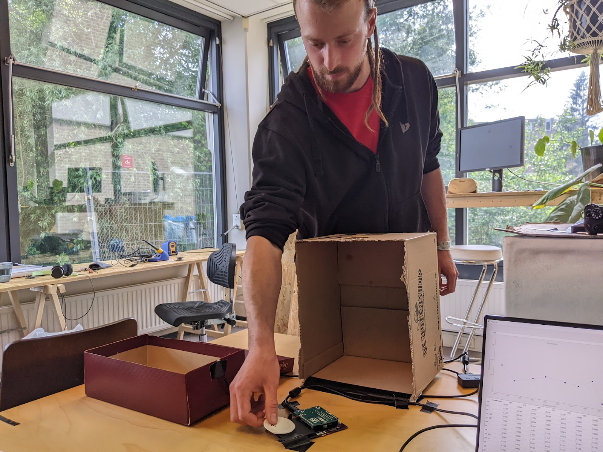
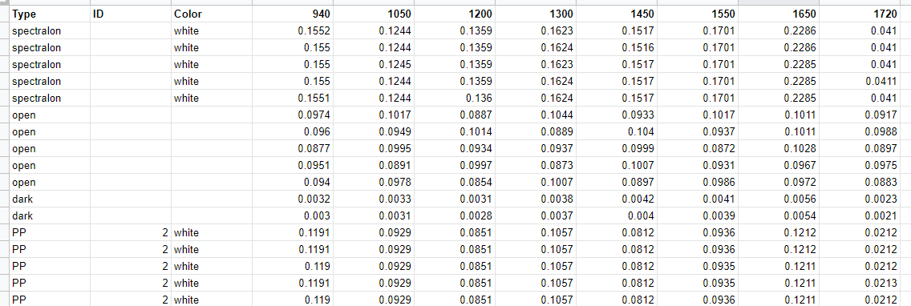
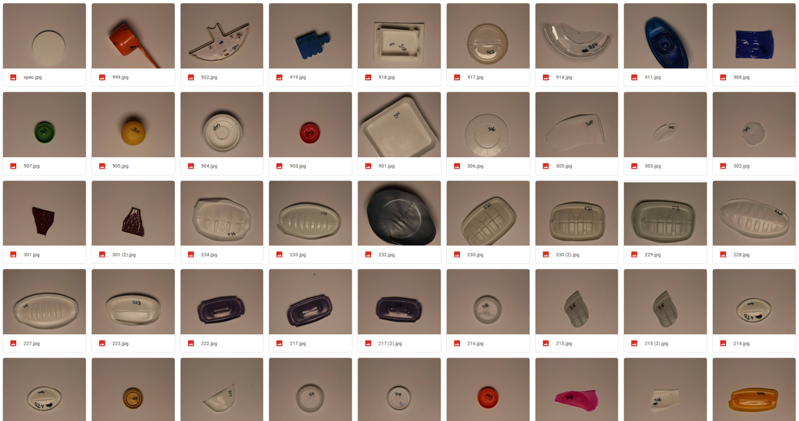

# How the data was collected
All made in a single day, on the 1st of June 2022
Measurements taken with DB2.1 board #01 and #03
## Installed LED’s: 

|Wavelength (nm) |940 |1050 |1200 |1300 |1460 |1550 |1650 |1720 |
|---|---|---|---|---|---|---|---|---|
|Current limiting resistor (Ω) |200 |150 |240 |240 |150 |150 |40 |130 |

Firmware version: used the firmware in this state: https://github.com/Plastic-Scanner/DB2.x-Firmware/tree/d3c327b010a1d05257fe97519fa377fe8ecc6a79

Spectraplot version: used the software in this state:
https://github.com/Plastic-Scanner/PSplot/tree/bea524f7bcbdfb529c8c889efb674bfaf6252db4

Workflow:
- Sample is chosen at random from bag of clean samples
- Sample is placed on #01 board
- Lid is closed
- Spectraplot asks the board to scan 5 times with 1 second interval
- Lid is opened
- Sample is moved to #03 board
- Lid is closed
- Spectraplot asks the board to scan 5 times with 1 second interval
- Lid is opened
- Sample is placed in photobooth for picture 

## How the data is structured

Data is structured like this👆, it starts with a spectralon sample, to have a flat reference response curve.
All the values are raw from the microcontroller, so they should be calibrated with the spectralon measurements if you want to compare the results from #01 board to the #03 board 
Remarks on data:
In the folder "img" there is a picture of each plastic sample

## How to process the data
Feel free to use your magic platform and code to start processing the data, but try to keep it as reproducible and understandable as possible. A good suggestion is Google Colab which can be commented on and runs in the cloud, so you don't need to install anything on your computer.