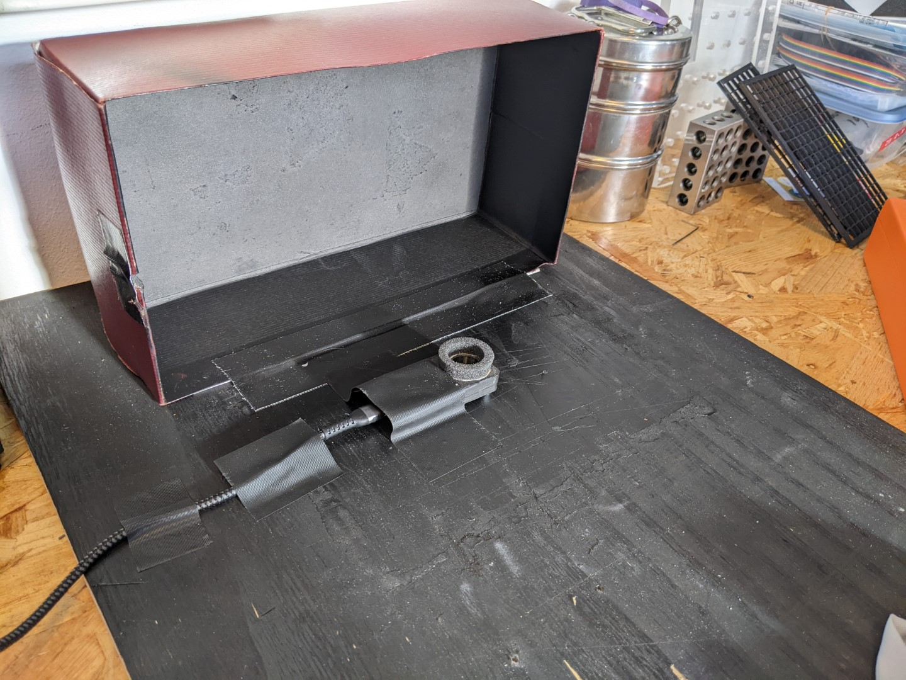
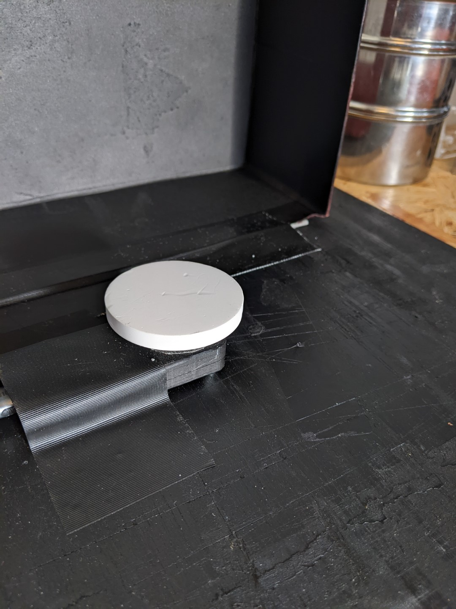

# Info
All data was collected in a single day, on January the 9th 2023
Measurements were taken with the Reremeter connected to a XPS15 laptop

Software and firmware was used from the original Reremeter repository
All samples from our reference sample box were measured 4 times at various locations of the plastic. All samples were measured with a spectralon backing. Afterwards the measurement data was annotated with Color and reading ID.

Important:
- reading 13 was done incorrect
- reading 102 was done with the box open

## Installed LEDs
white,850,940,1200,1300,1450,1550,1650nm

The setup looked like this:

